### Hi there 👋

<!--
**NoHeartPen/NoHeartPen** is a ✨ _special_ ✨ repository because its `README.md` (this file) appears on your GitHub profile.

Here are some ideas to get you started:

- 👯 I’m looking to collaborate on ...
- 🤔 I’m looking for help with ...
- 💬 Ask me about ...
- 📫 How to reach me: ...
- 🌱 I’m currently learning Japanese 
- 😄 Pronouns: ...
- ⚡ Fun fact: ...

</a>

-->

- 🏫 I'm a senior at Sichuan International Studies University and study Japanese Language and Literature.
- 🔭 I’m currently working on Japanese NLP and CAT.
- 📫 How to reach me: NoHeartPen@outlook.com

</a>

</a>

</a>
